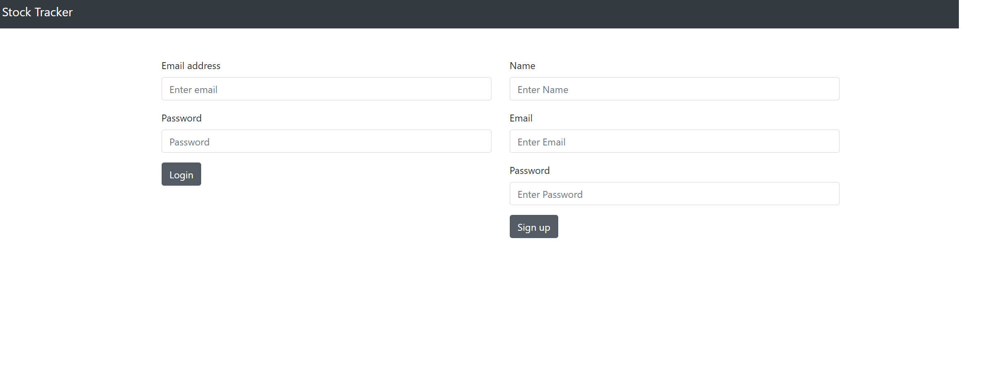
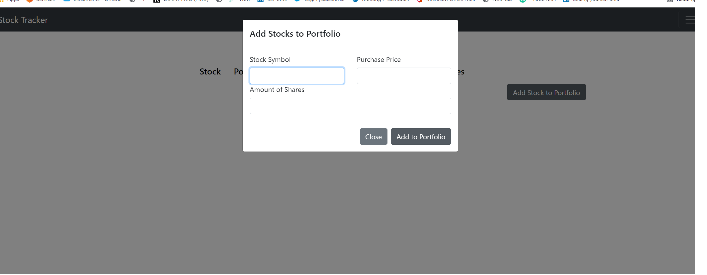

 
# iPortfolio

## Project Description 
The iPortfolio enables portfolio tracking capability with easy-to-use UI for the average investor. The application is intuitive and helps investors track stocks across platforms. 

## Table of Content

* [Installation](#installation)

* [Usage](#usage)

* [License](#license)

* [Contribution](#contribution)

* [Credit](#credits)

* [Test](#test)

* [Collaborators](#collaborators) 

## Installation
No steps to install

Below is the URL to the webpage and github repository. 

Website URL: https://pure-chamber-08412.herokuapp.com/

Github repository: https://github.com/tylerf808/iPortfolio

## Usage
Limited usage instructions. 

The sreenshot for the iPortfolio App is below. 

## License
The license used for this project is MIT. Here is the license link https://opensource.org/licenses/MIT

## Credits
node express, sql, handlebars, css, js, bcrypt, node-fetch
request, connect-session-sequelize, polygon, dotenv, express
express-handlebars, express-session, bootstrap

## Contribution
No contribution guideline

## Test
No test instructions

## Collaborators  
Tyler Fabian
Ryan Potere
Jacob Black
Carl Benbow

Contact team member below if you have any questions: 
* Github username: tylerf808
* Github URL: https://github.com/tylerf808
